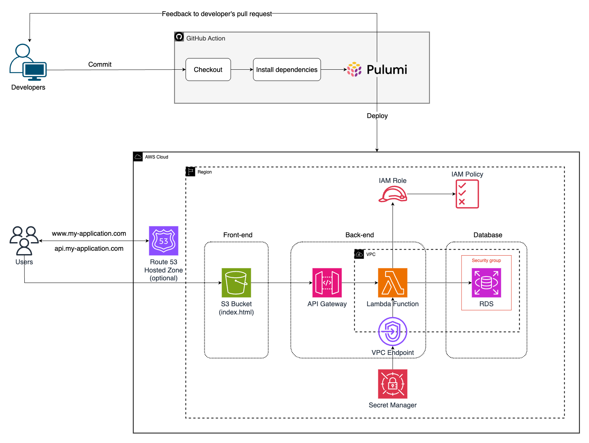

# Pulumi 3-Tier AWS Architecture with CI/CD

This project provisions a complete 3-tier architecture on AWS using Pulumi and automates deployment using GitHub Actions.

### Architecture Overview:
- **Frontend** hosted on Amazon S3 (Static Website)
- **API Layer** using AWS Lambda + API Gateway
- **Database Layer** using Amazon RDS (PostgreSQL)
- **Secrets Management** via AWS Secrets Manager
- **CI/CD Pipeline** powered by GitHub Actions

---

## Architecture Flowchart



---

## Tech Stack

- **Infrastructure as Code**: Pulumi (Python)
- **CI/CD**: GitHub Actions
- **AWS Services**: VPC, Subnets, Lambda, API Gateway, RDS, Secrets Manager, S3
- **Runtime**: Node.js (Lambda), PostgreSQL (RDS)
- **Secrets**: Pulumi Config + AWS Secrets Manager

---

## Requirements

- Pulumi CLI
- AWS CLI (configured with credentials)
- Node.js 18.x (for Lambda function)
- Python 3.x
- GitHub repository (for CI/CD)
- (Encourage) Take a look https://www.pulumi.com/docs/iac/get-started/aws/begin/

---

## Local Setup

1. **Install dependencies**

```bash
pip install -r requirements.txt
cd lambda/ && npm install
```

2. **Create a S3 bucket for Pulumi Backend and login**

```bash
aws s3api create-bucket \
  --bucket my-pulumi-state-bucket \
  --region ap-southeast-1 \
  --create-bucket-configuration LocationConstraint=ap-southeast-1
```
Change bucket name or region for your desire. Then we need to login

```bash
pulumi login s3://my-pulumi-state-bucket
```

3. **Create stacks for `prod` and `dev` for each environment**

```bash
# For the production environment
pulumi stack init prod

# For the development environment
pulumi stack init dev
```
You can create more stacks if you want. E.g: `stg` stands for staging

---

## CI/CD Setup - Required Secret Variables

To enable CI/CD with Pulumi and GitHub Actions, make sure to add the following secret variables to your repository:

| Environment Variable     | Description |
|--------------------------|-------------|
| `AWS_ACCESS_KEY_ID`      | The access key ID of your AWS IAM user. Used by GitHub Actions to authenticate with AWS. |
| `AWS_SECRET_ACCESS_KEY`  | The secret access key corresponding to the access key ID above. Keep this secure. |
| `AWS_REGION`             | The AWS region where resources will be deployed (e.g., `us-east-1`, `ap-southeast-1`). |
| `MY_GITHUB_TOKEN`        | Your personal GitHub token. Used by GitHub Actions to interact with GitHub APIs (e.g., creating PRs, posting comments). |
| `PULUMI_ACCESS_TOKEN`    | Your Pulumi access token. Allows GitHub Actions to run `pulumi up`, `pulumi destroy`, etc., on Pulumi Cloud. |

---

## Deploy Infrastructure
```bash
pulumi stack select prod|dev
pulumi up --yes
```
Pulumi will output information such as:
```bash
Outputs:
  api_url         : https://xyz123.execute-api.ap-southeast-1.amazonaws.com/prod/data
  rds_endpoint    : pulumi-rds.abcxyz123.ap-southeast-1.rds.amazonaws.com::<hidden_port>
  bucket_name     : dev-my-bucket
  bucket_endpoint : http://dev-my-bucket.s3-website-ap-southeast-1.amazonaws.com
```

## Result


---

## Project structure
```
├── __main__.py                     # Pulumi program
├── images
│   └── project-architecture.png
├── index.html                      # Final generated HTML file
├── index.template.html             # Template file with API placeholder
├── lambda                          # Lambda function source code (Node.js)
│   ├── index.js
│   └── package.json
├── Pulumi.dev.yaml                 # Pulumi stack config (dev environment)
├── Pulumi.prod.yaml                # Pulumi stack config (prod environment)
├── Pulumi.yaml                     # Pulumi project metadata
├── README.md
└── requirements.txt
```

---

## CI/CD with GitHub Actions

File path: `.github/workflows/[pull_requests|merge].yaml`

- Pulumi Infrastructure Deployment Automation: Automates infrastructure deployments using Pulumi.
- AWS Target: Deploys infrastructure to Amazon Web Services (AWS).
- Merge Branch-Based Deployment:
  - `master` branch: Deploys to the prod stack on push.
  - `develop` branch: Deploys to the dev stack on push.
- Pull Request Preview:
  - Previews infrastructure changes when pull requests target `master` or `develop`.
  - Comments preview results on the pull request for review.
- Automated Feedback: Provides automated feedback on infrastructure changes through previews and comments within pull requests.


## Secrets Management
- Database credentials are stored in Pulumi config (with secret protection)
- Pulumi provisions an AWS Secrets Manager secret with all RDS connection info
- The Lambda function receives the secret ARN as an environment variable (`SECRET_ARN`) and loads credentials securely

## Notes
- Lambda runs inside a VPC and requires proper subnet and security group configuration
- RDS instance is not public, access is only allowed from Lambda in the same VPC
- The HTML generation with the correct API_GATEWAY_URL occurs after the stack is provisioned

## Author
Huynh Thien Tung
